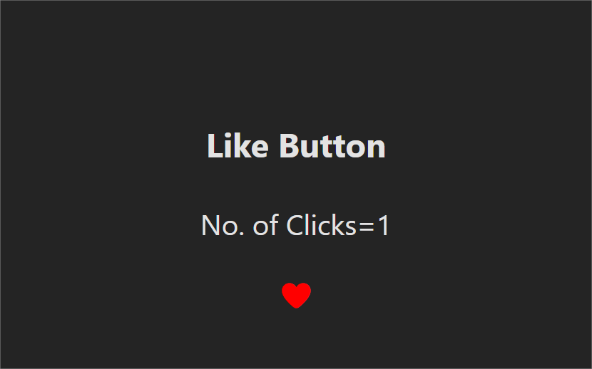

# ❤️ React Like Button

A simple React project demonstrating a like button with toggle functionality and click counter using the `useState` hook.

---

## 🚀 Tech Stack

* React
* Vite
* JavaScript
* CSS

---

## ✨ Features

* Toggle like/unlike ❤️
* Click counter 📊
* Dynamic UI updates
* Beginner-friendly implementation

---

## 📚 What I Learned

* Using `useState` hook
* Handling events in React
* Conditional rendering
* Managing component state

---

## 📸 Screenshot



---

## ▶️ Run Locally

Clone the project:

```bash
git clone https://github.com/shanusingh01/react-like-button.git
```

Go to project folder:

```bash
cd react-like-button
```

Install dependencies:

```bash
npm install
```

Run the project:

```bash
npm run dev
```

---

## 📌 Note

This is a beginner-level project built while learning React fundamentals.

---

## ⭐ Future Improvements

* Add animations to the like button
* Improve UI design
* Add persistence (save likes)
* Make it more interactive

---
